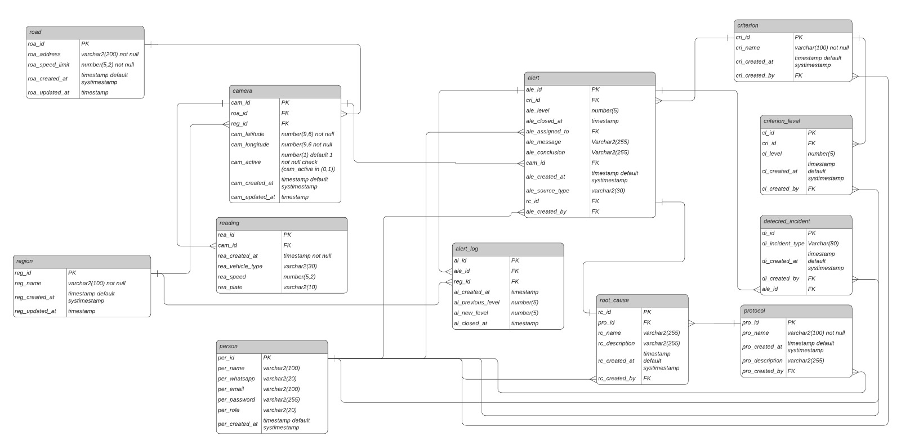

 

# 
Denarius Data

    <a href="#desafio">Desafio</a>  |  
    <a href="#solucao">Solução</a>  |   
    <a href="#backlog-do-produto">Backlog do Produto</a>  |  
    <a href="#dor">DoR</a>  |  
    <a href="#dor">DoD</a>  |  
    <a href="#cronograma-de-sprints">Cronograma de Sprints</a>  |  
    <a href="#tecnologias">Tecnologias</a> | 
    <a href="#manual-de-instalacao">Manual de Instalação</a> | 
    <a href="#manual-do-usuario">Manual do Usuário</a> | 
    <a href="#documentacao-api">Documentação API</a> | 
    <a href="#modelagem-de-banco-de-dados">Modelagem de Banco de Dados</a> | 
    <a href="#equipe">Equipe</a>

> Status do Projeto: Finalizado ✅   
> Pasta de Documentação: [Link](https://github.com/DenariusData/API-4SEM/tree/main/docs) 📄   
> Vídeo do Projeto: [A ser feito]() 📽️

## 🏅 Desafio

Diante da necessidade de aprimorar a gestão do tráfego urbano em São José dos Campos, o desafio consiste em implementar uma solução proativa de monitoramento e resposta a incidentes. A cidade carece de um sistema integrado que permita a tranformação de dados dos radares em insights acionáveis, a definição de indicadores específicos para disparo de alertas e a eficiente alocação de agentes de mobilidade para as áreas e situações mais críticas, otimizando assim os recursos e melhorando a fluidez do trânsito.

## 🏅 Solução

Foi desenvolvido um Sistema Inteligente de Monitoramento e Alerta de Tráfego. Esta solução centraliza o controle do trânsito por meio dos radares, permitindo o cadastro de indicadores e níveis de severidade personalizados. Com base nesses parâmetros, o sistema emite alertas automáticos, possibilita a seleção de subzonas estratégicas e facilita a designação inteligente de agentes de mobilidade para cada área. A solução é complementada por um dashboard interativo, que oferece uma visão consolidada e em tempo real de todos os indicadores de desempenho, padrões de tráfego e métricas dos agentes. Através deste painel, os gestores podem tomar decisões ágeis e embasadas em dados, elevando a eficiência operacional e a qualidade do gerenciamento do trânsito na cidade.

→ [Voltar ao topo](#denarius-data)

---

## 📋 Backlog do Produto

OBS: Foram necessárias alterações. Os user stories com * (asterisco) foram criados no planejamento da sprint 3, devido à mudanças no escopo (49 horas) e user stories com ~ (til) foram removidos por incapacidade de atender no prazo e / ou mudanças no escopo (70 horas)

| Rank | Prioridade | User Story | Story Points | Sprint |
|-|-|-|-|-|
| 1 | 🔴 Alta | Como gestor, quero informações sobre o trânsito em forma de dashboards, gráficos e tabelas para auxiliar minha tomada de decisão na diminuição de trânsito | 48 | 1 |
| 2 | 🔴 Alta | Como usuário da plataforma, quero um mapa na tela inicial, que tenha as divisões das zonas da cidade de São José dos Campos, para que eu possa ter uma visão detalhada dos locais que o sistema possui informação | 30 | 1 |
| 3 | 🔴 Alta | Como usuário publico ou como agente, quero uma tela com a documentação dos indicadores para saber o que está sendo avaliado na exibição do mapa da cidade | 42 | 1 |
| 4 | 🔴 Alta * | Como cliente, quero que cada permissão de usuário (gestor, agente e público) tenham acessos diferentes à cada funcionalidade | 26 | 3 |
| 5 | 🟡 Média ~ | Como gestor, quero que a tela de documentação dos indicadores (rank 3) ofereça a possibilidade de adicionar, editar e deletar os indicadores, para que eu tenha controle sobre o monitoramento do trânsito da cidade | 22 | 1 |
| 6 | 🟡 Média ~ | Como gestor, quero ter a possibilidade de alterar as definições dos níveis referentes a um indicador sem modificar a quantidade de níveis existentes, para que o disparo de alertas, que dependem desses níveis, ocorram em momentos controlados | 12 | 2 |
| 7 | 🟡 Média | Como gestor, quero poder associar um usuário agente a uma zona ou usuário gestor a uma zona, para que recebam informações específicas e centralizadas para atuar | 16 | 2 |
| 8 | 🟡 Média | Como agente e como gestor, quero receber alertas quando houver mudança nos níveis de qualquer indicador, para que eu tenha noção de quando o trânsito piorar e possa tomar medidas para solucionar o problema | 39 | 2 |
| 9 | 🟡 Média | Como gestor, quero que as zonas tenham informações das principais vias demarcadas e que apresentem o congestionamento dessa via, para que eu possa atuar de forma mais rápida e precisa em pontos críticos da cidade | 20 | 2 |
| 10 | 🟡 Média | Como gestor, quero poder criar “causas raíz” para alertas disparados e poder criar protocolos para essas “causas raíz”, para que o agente tenha uma orientação de como resolver os alertas que surgirem | 18 | 2 |
| 11 | 🟡 Média | Como agente, quero poder visualizar um alerta específico, para que possa documentar informações sobre este alerta, obter informações sobre como resolver o problema que gerou o alerta e finalizá-lo | 33 | 3 |
| 12 | 🟡 Média * | Como agente e como gestor, quero poder visualizar todos os alertas disponíveis na base | 16 | 3 |
| 13 | 🟡 Média * | Como gestor, quero poder visualizar e manipular todos os usuários disponíveis na base | 7 | 3 |
| 14 | 🟢 Baixa | Como gestor, quero ter logs dos alertas gerados, para registro de auditoria e estudo de histórico do comportamento do trânsito | 6 | 3 |
| 15 | 🟢 Baixa ~ | Como gestor, quero um chat interno no produto para que eu possa consultar informações que estão no banco de forma simplificada | 42 | 3 |

 

    
User Stories originais

     
    
| Rank | Prioridade | User Story | Story Points | Sprint |
|-|-|-|-|-|
| 1 | 🔴 Alta | Como gestor, quero informações sobre o trânsito em forma de dashboards, gráficos e tabelas para auxiliar minha tomada de decisão na diminuição de trânsito | 48 | 1 |
| 2 | 🔴 Alta | Como usuário da plataforma, quero um mapa na tela inicial, que tenha as divisões das zonas da cidade de São José dos Campos, para que eu possa ter uma visão detalhada dos locais que o sistema possui informação | 30 | 1 |
| 3 | 🔴 Alta | Como usuário publico ou como agente, quero uma tela com a documentação dos indicadores para saber o que está sendo avaliado na exibição do mapa da cidade | 42 | 1 |
| 4 | 🟡 Média | Como gestor, quero que a tela de documentação dos indicadores (rank 3) ofereça a possibilidade de adicionar, editar e deletar os indicadores, para que eu tenha controle sobre o monitoramento do trânsito da cidade | 22 | 1 |
| 5 | 🟡 Média | Como gestor, quero ter a possibilidade de alterar as definições dos níveis referentes a um indicador sem modificar a quantidade de níveis existentes, para que o disparo de alertas, que dependem desses níveis, ocorram em momentos controlados | 12 | 2 |
| 6 | 🟡 Média | Como gestor, quero poder associar um usuário agente a uma zona ou usuário gestor a uma zona, para que recebam informações específicas e centralizadas para atuar | 16 | 2 |
| 7 | 🟡 Média | Como agente e como gestor, quero receber alertas quando houver mudança nos níveis de qualquer indicador, para que eu tenha noção de quando o trânsito piorar e possa tomar medidas para solucionar o problema | 39 | 2 |
| 8 | 🟡 Média | Como gestor, quero que as zonas tenham informações das principais vias demarcadas e que apresentem o congestionamento dessa via, para que eu possa atuar de forma mais rápida e precisa em pontos críticos da cidade | 20 | 2 |
| 9 | 🟡 Média | Como gestor, quero poder criar “causas raíz” para alertas disparados e poder criar protocolos para essas “causas raíz”, para que o agente tenha uma orientação de como resolver os alertas que surgirem | 18 | 2 |
| 10 | 🟡 Média | Como agente, quero poder visualizar um alerta específico, para que possa documentar informações sobre este alerta, obter informações sobre como resolver o problema que gerou o alerta e finalizá-lo | 33 | 3 |
| 11 | 🟢 Baixa | Como gestor, quero ter logs dos alertas gerados, para registro de auditoria e estudo de histórico do comportamento do trânsito | 6 | 3 |
| 12 | 🟢 Baixa | Como gestor, quero um chat interno no produto para que eu possa consultar informações que estão no banco de forma simplificada | 42 | 3 |

→ [Voltar ao topo](#denarius-data)

---

## 🏃‍  DoR - Definition of Ready
- User Stories com Critérios de Aceitação
- Subtarefas divididas a partir das US
- Design no Figma
- Modelagem do Banco de Dados
- Diagrama de Rotas
- Banco de Dados Vetorizado do Cliente

## 🏆 DoD - Definition of Done
- Manual de Instalação
- Manual de Usuário
- Documentação da API (Application Programming Interface)
- Código completo
- Vídeos de cada etapa de entrega

→ [Voltar ao topo](#denarius-data)

---

## 📅 Cronograma de Sprints

| Sprint | Período | Histórico |
|-|-|-|
| SPRINT 1 | 08/09 - 28/09 | [Sprint 1 Docs](https://github.com/DenariusData/API-4SEM/blob/main/docs/processo/sprints/sprint-1/README.md) |
| SPRINT 2 | 06/10 - 26/10 | [Sprint 2 Docs](https://github.com/DenariusData/API-4SEM/blob/main/docs/processo/sprints/sprint-2/README.md) |
| SPRINT 3 | 03/11 - 23/11 | [Sprint 3 Docs](https://github.com/DenariusData/API-4SEM/blob/main/docs/processo/sprints/sprint-3/README.md) |

→ [Voltar ao topo](#denarius-data)

---

## 💻 Tecnologias

  
  
  
  
  
  
  
  
  
  
  

→ [Voltar ao topo](#denarius-data)

---

## 📖 Manual de instalação

Acesso ao manual pelo [Link](https://github.com/DenariusData/API-4SEM/blob/main/docs/install/README.md)
 

→ [Voltar ao topo](#denarius-data)

---

## 📘 Manual do usuário

Acesso ao manual pelo [Link](https://drive.google.com/file/d/1L-FXcJWop9PP2Nl430whKPjNdSdH5czI/view?usp=sharing)
 

→ [Voltar ao topo](#denarius-data)

---

## 📓 Documentação API

Acessar à documentação Swagger pelo [Link](https://drive.google.com/drive/folders/1cTevsjRi3AkroBniEprjlUZcLx0zNM3g?usp=sharing)

→ [Voltar ao topo](#denarius-data)

---

## 🖥️ Modelagem de Banco de Dados

→ [Voltar ao topo](#denarius-data)

---

## :busts_in_silhouette: Equipe

|    Função     | Nome                  | LinkedIn & GitHub |
|---------------|-----------------------|-------------------|
| Product Owner | Augusto Piatto        |   |
| Scrum Master  | Beatriz Sthefanny     |   |
| Dev Team      | Caio Osorio           |   |
| Dev Team      | Davi Soares           |   |
| Dev Team      | João Paulista         |   |
| Dev Team      | Rafael Slivka         |   |
| Dev Team      | Tiago Bernardo        |   |
| Dev Team      | Tiago Torres          |   |
| Dev Team      | Victor Ryan           |   |

→ [Voltar ao topo](#denarius-data)
