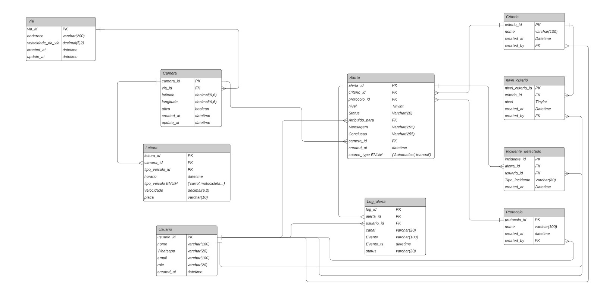

# Sprint Planning

## 1️⃣ Sprint 1

Modelagem física do banco de dados

### 📝 US-1: Critérios de mobilidade definidos
#### Descrição: Eu como gestor desejo que tenha bem definido os critérios de mobilidade para que eu possa visualizar em que situação se encontra um indicador para que eu possa determinar o nível que se encontra uma área

#### Regras de negócio
- Os critérios são a base dos indicadores.

#### 🆗 Definition of Ready(DoR)
- N/A

#### 🏁 Definition of Done(DoD)
- Documento entregue contendo os critérios de mobilidade e uma breve descrição de cada um.

#### 🎯 Critérios de aceitação
- Existe um documento com os critérios de mobilidade.
- Cada critério possui breve descrição.
- Os critérios permitem determinar a situação de cada indicador e, consequentemente, o nível da área.

#### Documentos 📁
[Critérios e níveis de mobilidade](https://drive.google.com/file/d/1IKE2cbQQ0cMa3z-ZV18vwZaXsBptKfXH/view?usp=drive_link)

---

### 📝 US-2: Níveis de alerta por critério
#### Descrição: Eu como gestor desejo que tenha bem definido os níveis de alerta de acordo com os critérios de mobilidade para que eu possa determinar qual nível se encontra a área para caso tenha algum problema seja possível assim exibir o protocolo adequado definido pela prefeitura

#### Regras de negócio
- Níveis de alerta baseados nos critérios de mobilidade.
- Exibição do protocolo adequado conforme nível.

#### 🆗 Definition of Ready(DoR)
- N/A

#### 🏁 Definition of Done(DoD)
- Documento entregue com os níveis de alerta por critério e breve descrição; níveis devem ser editáveis.

#### 🎯 Critérios de aceitação
- Existe um documento com os níveis de alerta de cada critério, com breve descrição.
- Níveis de alerta são editáveis.
- Com base no nível, é possível exibir o protocolo adequado definido pela Prefeitura.

#### Documentos 📁
TODO

---

### 📝 US-3: Página “Níveis” por região
#### Descrição: Eu como gestor do sistema quero que tenha uma página mostrando os níveis de acordo com os critérios de mobilidade para que eu possa visualizar em qual nível se encontram as áreas

#### Regras de negócio
- Visualização por região conforme critérios pré-estabelecidos.

#### 🆗 Definition of Ready(DoR)
- User story claramente definida;
- Critérios de aceitação descritos;
- Tasks criadas no quadro Kanban;
- Tarefas devidamente estimadas para o desenvolvimento.

#### 🏁 Definition of Done(DoD)
- A página estará pronta quando houver um botão “Níveis”; ao entrar, será possível ver os critérios pré-estabelecidos e os respectivos níveis por região.

#### 🎯 Critérios de aceitação
- Há um botão “Níveis”.
- Ao acessar, a página exibe os critérios pré-estabelecidos e os respectivos níveis por região.

#### Vídeo 📹
TODO

---

### 📝 US-4: Dashboard dos corredores principais
#### Descrição: Eu como Agente de Mobilidade e Gestor do sistema quero que seja possível visualizar em uma página 1 exemplo de dashboard dinâmico para mostrar os principais corredores da cidade pré-definidos sendo eles R. Bacabal, Av. Cassiano Ricardo e Av. Dr. Nélson d'Ávila , para que eu possa realizar análise de qual corredor é mais movimentado

#### Regras de negócio
- Dashboard dinâmico de exemplo com os três corredores pré-definidos.

#### 🆗 Definition of Ready(DoR)
- User story claramente definida;
- Critérios de aceitação descritos;
- Tasks criadas no quadro Kanban;
- Tarefas devidamente estimadas para o desenvolvimento.

#### 🏁 Definition of Done(DoD)
- Na página principal haverá um botão que leva ao dashboard; ao acessá-lo, o dashboard será visualizado normalmente com os três corredores pré-definidos.

#### 🎯 Critérios de aceitação
- Na página principal há um botão que leva ao dashboard.
- Ao acessar, o dashboard exibe os três corredores pré-definidos (R. Bacabal, Av. Cassiano Ricardo, Av. Dr. Nélson d’Ávila).

#### Vídeo 📹
TODO

---

### 📝 US-5: Mapa público com níveis por área
#### Descrição: Eu como população quero que seja possível visualizar em uma página um mapa da cidade contendo os níveis dos indicadores de cada área para que eu possa entender em que situação se encontra a área desejada 

#### Regras de negócio
- Página pública (sem login).
- Mapa exibe níveis dos indicadores por área.

#### 🆗 Definition of Ready(DoR)
- User story claramente definida;
- Critérios de aceitação descritos;
- Tasks criadas no quadro Kanban;
- Tarefas devidamente estimadas para o desenvolvimento.

#### 🏁 Definition of Done(DoD)
- Ao entrar no sistema, o mapa da cidade será carregado exibindo os níveis por área, acessível sem autenticação (público).

#### 🎯 Critérios de aceitação
- Ao entrar no sistema, o mapa da cidade carrega exibindo os níveis por área.
- Acesso sem autenticação (público).

#### Vídeo 📹
TODO

---

#### 📉 Burndown:
TODO

## 2️⃣ Sprint 2

### 📝 US-6: Gráficos pré-definidos com filtros
#### Descrição: Eu como gestor do sistema desejo popular gráficos pré-definidos como gráfico de barra, gráfico de pizza e gráfico de dispersão passando os filtros que desejo para que eu possa ter a liberdade de escolher os gráficos e as informações que serão filtradas

#### Regras de negócio
- Tipos de gráfico: barra, pizza e dispersão.
- Filtros escolhidos pelo usuário.

#### 🆗 Definition of Ready(DoR)
- User story claramente definida;
- Critérios de aceitação descritos;
- Tasks criadas no quadro Kanban;
- Tarefas devidamente estimadas para o desenvolvimento.

#### 🏁 Definition of Done(DoD)
- Na interface, será possível selecionar filtros e o tipo de gráfico; ao confirmar, os gráficos serão exibidos com os dados correspondentes.

#### 🎯 Critérios de aceitação
- Interface permite selecionar filtros e o tipo de gráfico (barra, pizza, dispersão).
- Ao confirmar, os gráficos são exibidos com os dados correspondentes.

#### Vídeo 📹
TODO

---

### 📝 US-7: Recebimento e gestão de alertas
#### Descrição: Eu enquanto Agente de mobilidade e Gestor do sistema quero que seja possível receber os alertas para que possam ser investigados e posteriormente serem exibidos os protocolos adequados definidos pela prefeitura

#### Regras de negócio
- Alertas alinhados aos níveis definidos.
- Exibição de protocolos definidos pela Prefeitura.

#### 🆗 Definition of Ready(DoR)
- User story claramente definida;
- Critérios de aceitação descritos;
- Tasks criadas no quadro Kanban;
- Tarefas devidamente estimadas para o desenvolvimento.

#### 🏁 Definition of Done(DoD)
- Quando ocorrerem condições que gerem alerta, eles serão exibidos no sistema; será possível abrir os detalhes, registrar a investigação e visualizar o “Protocolo recomendado”.

#### 🎯 Critérios de aceitação
- Quando ocorrerem condições que gerem alerta, eles são exibidos no sistema.
- É possível abrir detalhes, registrar a investigação e visualizar o “Protocolo recomendado”.

#### Vídeo 📹
TODO

---

#### 📉 Burndown:
TODO

## 3️⃣ Sprint 3

### 📝 US-8: Chat com os dados (LN)
#### Descrição: Eu enquanto gestor do sistema quero que tenha um chat na tela onde seja possível eu fazer perguntas direto para meus dados do banco de dados em linguagem natural e que ele me retorne a resposta em linguagem natural para que possa obter análises avançadas pela IA

#### Regras de negócio
- Perguntas e respostas em linguagem natural sobre os dados do banco.

#### 🆗 Definition of Ready(DoR)
- User story claramente definida;
- Critérios de aceitação descritos;
- Tasks criadas no quadro Kanban;
- Tarefas devidamente estimadas para o desenvolvimento.

#### 🏁 Definition of Done(DoD)
- Haverá um campo “Chat com os dados”; ao perguntar (ex.: “Quais áreas estão no nível mais crítico hoje?”), o sistema responderá com base nos indicadores atuais.

#### 🎯 Critérios de aceitação
- Campo “Chat com os dados” disponível.
- Usuário faz pergunta em linguagem natural sobre os dados do banco.
- Sistema responde em linguagem natural com base nos indicadores atuais.

#### Vídeo 📹
TODO

---

### 📝 US-9: Níveis de acesso por perfil
#### Descrição: Eu como gestor do sistema desejo que tenha os seguintes níveis de acesso: usuário geral(sem login), agentes de mobilidade e gestores ambos contendo login, para que no sistema haja uma segurança em relação aos dados que cada grupo poderá acessar

#### Regras de negócio
- Perfis: usuário geral (sem login), agentes e gestores (com login).
- Segurança por restrição de funcionalidades/dados por perfil.
- Mapa público sem login.

#### 🆗 Definition of Ready(DoR)
- User story claramente definida;
- Critérios de aceitação descritos;
- Tasks criadas no quadro Kanban;
- Tarefas devidamente estimadas para o desenvolvimento.

#### 🏁 Definition of Done(DoD)
- Ao acessar com cada perfil, somente as funcionalidades e dados permitidos estarão disponíveis; o mapa público permanece acessível sem login.

#### 🎯 Critérios de aceitação
- Ao acessar com cada perfil (usuário geral sem login; agentes/gestores com login), apenas as funcionalidades e dados permitidos ficam disponíveis.
- O mapa público permanece acessível sem login.

#### Vídeo 📹
TODO

---

#### 📉 Burndown:
TODO
