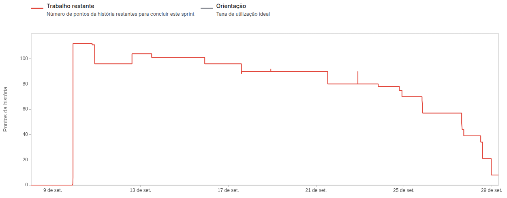

# Documentação - Sprint 1

## 
Denarius Data

    <a href="#desafio">Desafio</a>  |  
    <a href="#user-stories">User Stories</a>  |   
    <a href="#dor">DoR</a>  |  
    <a href="#dor">DoD</a>  |  
    <a href="#burndown">Burndown</a>  |  
    <a href="#equipe">Equipe</a>

> Status da Sprint: Concluída ✅

## 🏅 Desafio

Implementar a base do sistema, permitindo que gestores e usuários acompanhem indicadores de mobilidade urbana através de dashboards interativos, mapas zonais e documentação técnica dos indicadores. Foi necessário garantir uma interface e um fluxo claro para garantir a evolução do sistema sem retrabalhos. 

## 📋 User Stories

Capacidade estimada da Equipe na Sprint: 135 Story points (horas)

Meta da Sprint: User Stories de rank 1 e rank 2 (total de 78 Story Points)

Previsão da Sprint: User Story de rank 3 (42 Story Points)

| Rank | Prioridade | User Story | Story Points | Sprint |
|-|-|-|-|-|
| 1 | 🔴 Alta | Como gestor, quero informações sobre o trânsito em forma de dashboards, gráficos e tabelas para auxiliar minha tomada de decisão na diminuição de trânsito | 48 | 1 |
| 2 | 🔴 Alta | Como usuário da plataforma, quero um mapa na tela inicial, que tenha as divisões das zonas da cidade de São José dos Campos, para que eu possa ter uma visão detalhada dos locais que o sistema possui informação | 30 | 1 |
| 3 | 🔴 Alta | Como usuário publico ou como agente, quero uma tela com a documentação dos indicadores para saber o que está sendo avaliado na exibição do mapa da cidade | 42 | 1 |

## 🏃‍ DoR

|             Critério             | Descrição                                                                                         |
| :------------------------------: | ------------------------------------------------------------------------------------------------- |
|       Clareza na Descrição       | A User Story está escrita no formato “Como [persona], quero [ação] para que [objetivo]”           |
| Critérios de Aceitação Definidos | A história possui critérios objetivos que indicam o que é necessário para considerá-la concluída. |
|    Compreensão Compartilhada     | Toda a equipe (incluindo PO e devs) compreende o propósito da história.                           |
|            Estímável             | A história foi pontuada no Planning Poker ou tem uma estimativa clara.                            |
|       Documentos de Apoio        | Se necessário, mockups, fluxos ou modelos de dados estão anexados ou referenciados.               |
|    Validação com PO e equipe     | A história foi discutida em refinamento ou planning e validada com o time técnico.                |
|   Critérios Técnicos Acordados   | As necessidades de Frontend e Backend foram claramente separadas (quando aplicável).              |

## 🏆 DoD

|                 Critério                 | Descrição                                                                                                        |
| :--------------------------------------: | ---------------------------------------------------------------------------------------------------------------- |
|     Critérios de Aceitação atendidos     | Todos os cenários definidos na US foram implementados e validados com sucesso.                                   |
| Cenários de Teste executados e aprovados | Todos os cenários descritos foram validados manualmente.                                                         |
|      Feedback Visual Implementado        | Funcionalidades como pop-ups, mensagens de erro ou barras de progresso estão claras e acessíveis ao usuário.     |
|        Fluxo Seguro e Controlado         | Não há caminhos quebrados nem submissões incoerentes no fluxo de avaliação ou navegação.                         |
|      Código Revisado (Code Review)       | O código foi revisado por pelo menos um colega de equipe.                                                        |
|     Documentação Interna Atualizada      | Foi atualizado o que for necessário: API, estrutura de dados, endpoints, etc.                                    |
|  Integração Com o Restante da Aplicação  | A funcionalidade foi testada junto com o fluxo completo do sistema (Ex: Envio → Resposta → Avaliação → Escolha). |
|             Validação do PO              | O PO testou e confirmou que a funcionalidade atende ao esperado.                                                 |
|            Pronto para deploy            | A funcionalidade pode ser entregue ao ambiente de produção/testes finais sem pendências.                         |

## 📉 Burndown

## 👥 Equipe

|    Função     | Nome                  | LinkedIn & GitHub |
|---------------|-----------------------|-------------------|
| Product Owner | Augusto Piatto        |   |
| Scrum Master  | Beatriz Sthefanny     |   |
| Dev Team      | Caio Osorio           |   |
| Dev Team      | Davi Soares           |   |
| Dev Team      | João Paulista         |   |
| Dev Team      | Rafael Slivka         |   |
| Dev Team      | Tiago Bernardo        |   |
| Dev Team      | Tiago Torres          |   |
| Dev Team      | Victor Ryan           |   |

